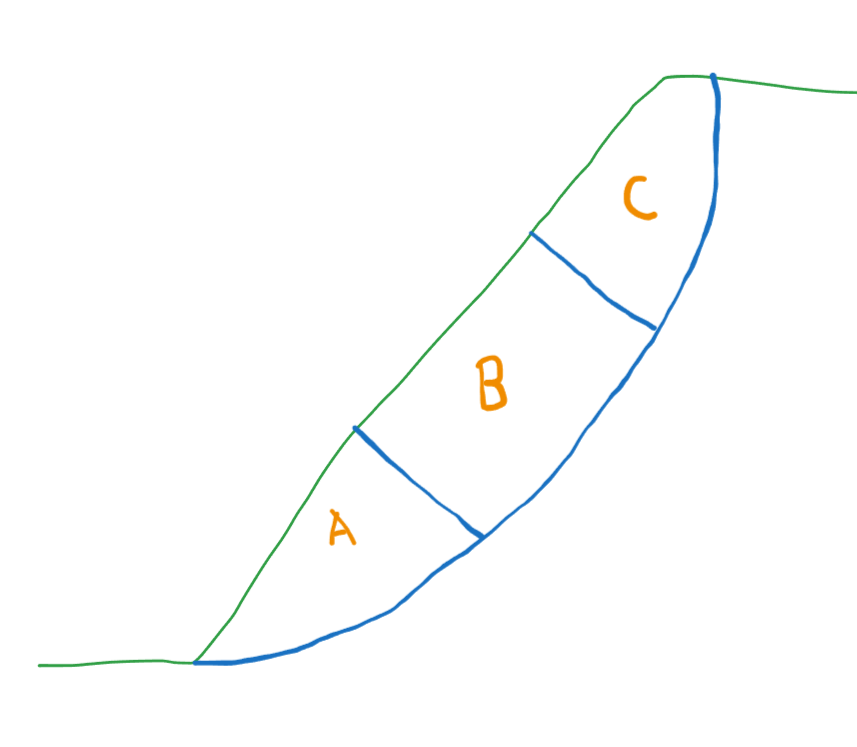

## Cases

## Default:
- AB & BC: Straight with offset

## Case 1:
- A & C: Log spiral with same/different origins
- B: Straight

## Case 2:
- A & B & C: Log spiral with different origins

## Case 3:
- A & C: Log spiral with same/different origins
- B: Straight
- AB & BC: Parabolic

## Case 4:
- A & B & C: Log spiral with different origins
- AB & BC: Parabolic